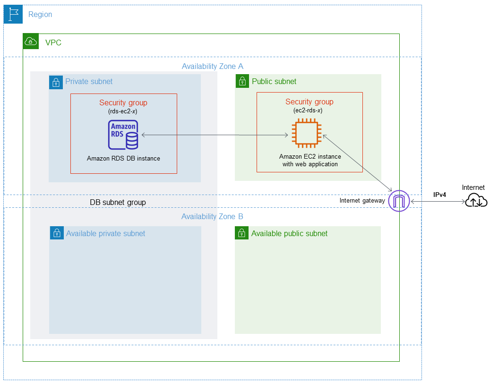

## Create a Web Server and an Amazon RDS DB Instance

## Description
This project demonstrates how to set up a basic EC2 instance as a web server and connect it to an Amazon RDS database instance. We will use Terraform for Infrastructure as Code (IaC) to automate the provisioning of both the EC2 instance and the RDS database.

## Architecture Diagram 



## Prerequisites

Before proceeding, make sure you have the following:

- AWS account with administrative access
- AWS CLI installed and configured
- Terraform installed (v0.13+)
- SSH key pair for accessing the EC2 instance
 
## Steps

## Manaual (UI Based)

[AWS EC2 Webserver With RDS DB](https://docs.aws.amazon.com/AmazonRDS/latest/UserGuide/TUT_WebAppWithRDS.html)


## 1. Set Up the EC2 Web Server
- Launch an EC2 instance using Terraform that will act as your web server.
- The web server will host a simple application (e.g., a Python/Node.js app).
- Make sure to open port 80 in the Security Group for HTTP access.

## 2. Provision Amazon RDS Instance
- Create an Amazon RDS instance using Terraform.
- Choose a database engine (e.g., MySQL or PostgreSQL) and specify instance details like db.t2.micro for free-tier eligibility.
- Ensure the RDS instance is in the same VPC as the EC2 instance for easy connectivity.

## 3. Connect EC2 to RDS
- Update the web server configuration to connect to the RDS instance using the database’s endpoint, username, and password.
- Use a simple application code snippet that performs a connection test to the RDS instance.
  
# Terraform Configuration

In this folder consist of Terraform configuration for both the EC2 instance and RDS database

### NOTE :- The Terraform code is for example refference please verify on your own and deploy it


## Create the Secrets file
Create a secrets file called secrets.tfvars and populate it with the follow secrets:

- **db_username** <-- this is going to be the master user for RDS
- **db_password** <-- this is going to be the RDS master user's password
- **my_ip** <-- this is going to be your public IP
  
## Running the Configuration

## Initializing the Terraform directory

## Run the command:

```
terraform init
```

## Plan and Apply the Terraform Config to AWS

```
terraform plan
```

```
terraform apply -var-file="secrets.tfvars"
```

## Verify the Deployment
- Access the EC2 instance via SSH and deploy the web application.
- Test the connection between the web server and the RDS instance.
- Ensure the web server can communicate with the database and retrieve/store data.

## Cleanup

Once done, you can destroy the infrastructure by running:

```
terraform destroy
```

### Additional Resources

[AWS EC2 Webserver With RDS DB](https://docs.aws.amazon.com/AmazonRDS/latest/UserGuide/TUT_WebAppWithRDS.html)


